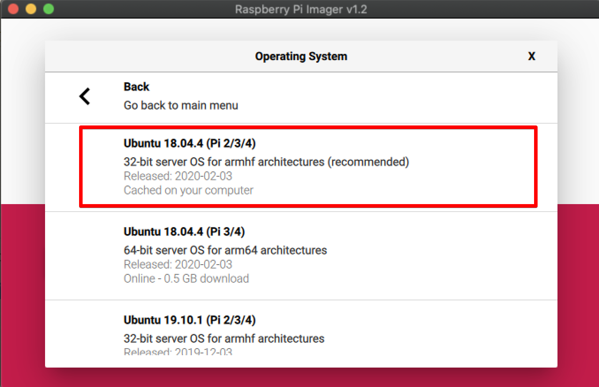

# Setting Up a New Raspberry Pi


## Operating System
1) I had an SD card pre-installed with NOOBS, so just plugged it in to power, a monitor and a keyboard, and was prompted to select my OS: `Raspbian [RECOMMENDED]`

- If you don't have an SD card with NOOBS, follow instructions [here](https://thepi.io/how-to-install-noobs-on-the-raspberry-pi/)
- If you are reformatting an SD card that used to have NOOBS/raspbian, I followed instructions [here](https://apple.stackexchange.com/questions/226016/how-to-remove-partition-on-sd-card-using-a-mac/269148)

2) Follow prompts
- Reset password
- Wifi setup

### SSH Tings
1) Enable SSH
- Instructions [here](https://www.raspberrypi.org/documentation/remote-access/ssh/)
- Get hostname by running `ifconfig`

2) SSH in..

```
→ ssh pi@192.168.0.22
The authenticity of host '192.168.0.22 (192.168.0.22)' can't be established.
ECDSA key fingerprint is SHA256:TSC2QT/GchXZT+vCVwBicj777+4g+qBwsi3iQn0HP5o.
Are you sure you want to continue connecting (yes/no)? yes
Warning: Permanently added '192.168.0.22' (ECDSA) to the list of known hosts.
pi@192.168.0.22's password:
Linux raspberrypi 4.14.71-v7+ #1145 SMP Fri Sep 21 15:38:35 BST 2018 armv7l

The programs included with the Debian GNU/Linux system are free software;
the exact distribution terms for each program are described in the
individual files in /usr/share/doc/*/copyright.

Debian GNU/Linux comes with ABSOLUTELY NO WARRANTY, to the extent
permitted by applicable law.
Last login: Sat Oct 13 10:24:49 2018
pi@raspberrypi:~ $ pwd
/home/pi
pi@raspberrypi:~ $ logout
Connection to 192.168.0.22 closed.
```

3) Renaming your PI

This is so I know which raspberry pi is which when I'm looking at connected devices on my router

`$ sudo vi /etc/hostname`

Whatever you change your hostname to, you need to add it to `/etc/hosts`.
For example, if you changed your hostname to `mypi`, add the following:

`127.0.0.1       mypi`

to the end of `/etc/hosts`

4) Enable passwordless SSH

- Instructions [here](https://www.raspberrypi.org/documentation/remote-access/ssh/passwordless.md)

TLDR:

- If you already have a `~/.ssh/id_rsa.pub`, just do:

`cat ~/.ssh/id_rsa.pub | ssh pi@192.168.0.22 'mkdir -p ~/.ssh && cat >> ~/.ssh/authorized_keys'`

5) Static IP Address

Followed instructions [here](https://www.modmypi.com/blog/how-to-give-your-raspberry-pi-a-static-ip-address-update), and added the following to the end of my `/etc/dhcpcd.conf` file:

```
interface eth0

static ip_address=192.168.0.22/24
static routers=192.168.0.1
static domain_name_servers=192.168.0.1

interface wlan0

static ip_address=192.168.0.22/24
static routers=192.168.0.1
static domain_name_servers=192.168.0.1
```

6) Adding some SSH shortcuts
- Remember hostnames is annoying, so adding some ssh shortcuts to my personal macbook


`$ vi ~/.ssh/config`

```
Host pi1
    HostName 192.168.0.17
    User pi

Host pi2
    HostName 192.168.0.22
    User pi
```

### Camera Tings

**IMPORTANT:** See python 3 section below for instructions on how to get python 3 installed, and alias `python` to use `python3`.

1) Enable Camera

- `$ sudo raspi-config`
- Interfacing Options
- Camera --> Yes

2) OpenCV


```
sudo pip3 install numpy

sudo apt install cmake gcc g++ git libjpeg-dev libpng-dev libtiff5-dev libavcodec-dev libavformat-dev libswscale-dev pkg-config libgtk2.0-dev libopenblas-dev libatlas-base-dev liblapack-dev libeigen3-dev libtheora-dev libvorbis-dev libxvidcore-dev libx264-dev sphinx-common libtbb-dev yasm libopencore-amrnb-dev libopencore-amrwb-dev libopenexr-dev libgstreamer-plugins-base1.0-dev libavcodec-dev libavutil-dev libavfilter-dev libavformat-dev libavresample-dev ffmpeg

wget https://github.com/opencv/opencv/archive/3.4.3.zip
unzip 3.4.3
cd opencv-3.4.3

mkdir release
cd release

cmake -DBUILD_TIFF=ON -DBUILD_opencv_java=OFF -DWITH_CUDA=OFF -DWITH_OPENGL=ON -DWITH_OPENCL=ON -DWITH_IPP=ON -DWITH_TBB=ON -DWITH_EIGEN=ON -DWITH_V4L=ON -DWITH_VTK=OFF -DBUILD_TESTS=OFF -DBUILD_PERF_TESTS=OFF -DCMAKE_BUILD_TYPE=RELEASE ..


make -j -l 2
sudo make install
```

**NOTE:** If you have any issues running the `make` command, you may need to fiddle with the parameters. See #2 for a user who had this issue.

Testing:

- requires picamera, installed below

```python
import picamera
import cv2
from picamera.array import PiRGBArray
import numpy as np
import time


with picamera.PiCamera() as camera:
    camera.resolution = (640, 480)
    camera.framerate = 32
    print('Warming up camera')
    time.sleep(2)

    raw_capture = PiRGBArray(camera, size=(640, 480))
    i = 0
    for f in camera.capture_continuous(raw_capture, 'bgr',
                                       use_video_port=True):
        print (i)
        frame = f.array

        gray = cv2.cvtColor(frame, cv2.COLOR_BGR2GRAY)
        cv2.imwrite('{}.png'.format(i), gray)

        # clear the stream in preparation for the next frame
        raw_capture.truncate(0)
        i += 1
        if i > 5:
            break
```

- [Reference](https://www.scivision.co/anaconda-python-opencv3/)
- If the above doesnt work, try the [more detailed guide by Adrian Rosebrock](https://www.pyimagesearch.com/2017/09/04/raspbian-stretch-install-opencv-3-python-on-your-raspberry-pi/)

3) Install some python packages

```
sudo pip install picamera
sudo pip install git+https://github.com/ian-whitestone/pantilt-hat.git
```

Check that the camera is working:

`python3 -c "from picamera import PiCamera; import time; camera = PiCamera(); time.sleep(3); camera.capture('/home/pi/image.jpg')"`
`scp pi1:image.jpg .`

4) pantilthat

- Enable I2C bus: 

    - `sudo raspi-config`
    - Interface Options
    - I2C

- Install drivers/packages: https://github.com/pimoroni/pantilt-hat

```bash
sudo apt-get install pimoroni
pip3 install pantilthat
```

Testing:

```
➜  ~ python
Python 3.6.3 (default, Oct 13 2018, 14:52:29)
[GCC 6.3.0 20170516] on linux
Type "help", "copyright", "credits" or "license" for more information.
>>> import pantilthat
>>> import pantilthat as pt
>>> pt.get_pan()
30
>>> pt.get_tilt()
30
>>> pt.tilt(0)
>>> pt.pan(0)
>>>
```

### Other Tings

1) Get oh-my-zsh

[Instructions](https://escapologybb.com/oh-my-zsh/)

```bash
sudo apt-get update && sudo apt-get upgrade 
sudo apt-get install git zsh
chsh -s /bin/zsh

# Get oh-my-zsh
sh -c "$(wget https://raw.githubusercontent.com/robbyrussell/oh-my-zsh/master/tools/install.sh -O -)"
```

2) Get arrow keys working in python interpreter
[Source](https://askubuntu.com/questions/958998/arrow-keys-not-working-in-python-interpreter)

- `sudo pip install readline`
- `sudo apt install libreadline-dev`

3) GPIO Testing

`sudo pip3 install RPi.GPIO`

```python
import time
import RPi.GPIO as GPIO

GPIO.setmode(GPIO.BCM)
GPIO.setup(21, GPIO.IN)


while True:
    print (GPIO.input(21))
    time.sleep(0.1)
```

4) Install Screen

`sudo apt-get install screen`

### Conda


**IMPORTANT:** I had some issues with conda, particularly when trying to get it to work with the pantilt library, so ended up not using it and installing python 3 from source, see section below for info on how to do that.

Install miniconda

```bash
wget http://repo.continuum.io/miniconda/Miniconda3-latest-Linux-armv7l.sh
sudo md5sum Miniconda3-latest-Linux-armv7l.sh
sudo /bin/bash Miniconda3-latest-Linux-armv7l.sh

# when prompted, change install path to /home/pi/miniconda3
```

Add the following to your `~/.bashrc` or `~/.zshrc`:

`export PATH=/home/pi/miniconda3/bin:$PATH`

Resource your profile:

`source ~/.zshrc`

And check your python path:

```bash
>>> which python
/home/pi/miniconda3/bin/python
```

Now install the anaconda-client so you can create conda environments:

```
sudo chown -R pi miniconda3
conda install anaconda-client
```

Create new environment:

`conda create -n test python=3 -y`

And activate it:

`source activate test`


Check which pip is the default:

`which pip`

If its not `/home/pi/miniconda3/bin/pip`, run a `conda install pip`, resource profile, and make sure `which pip` is now point to correct one.

`pip install --upgrade pip`


### Python 3

Conda python doesnt work as well on an RPI, particularly when trying to get the `pantilthat` library with I2C and smbus working.
Installing python 3 from source.


```
sudo apt-get install python3-dev libffi-dev libssl-dev -y
wget https://www.python.org/ftp/python/3.6.3/Python-3.6.3.tar.xz
tar xJf Python-3.6.3.tar.xz
cd Python-3.6.3
./configure
make
sudo make install
sudo pip3 install --upgrade pip
```

Testing out:

```
>>> which python3
/usr/local/bin/python3
>>> python3 --version
Python 3.6.3
```

Add some aliases to `~/.zshrc`:

```
alias python=python3
alias pip=pip3
```

### Redis

Followed instructions from this [blog post](http://mjavery.blogspot.com/2016/05/setting-up-redis-on-raspberry-pi.html).

**Note:**
this line: `sudo cp utils/redis_init_script /etc/init.d/redis_6379`
should be: `sudo cp utils/redis_init_script /etc/init.d/redis`

As pointed out by someone in the comments.

### Security and System Monitoring

#### fail2ban
Coming soon...

#### Glances

See [docs](https://glances.readthedocs.io/en/latest/install.html)

`pip install glances[action,browser,cpuinfo,chart,web,wifi]`

**Note:** if you are running this in a zsh shell, you need to escape the square brackets.

`pip install glances\[action,browser,cpuinfo,chart,web,wifi\]`


Kick it off:

`glances -w`


# Fresh Setup with Ubuntu

## Flashing OS Image to SD Card

1. Downloaded Raspberry Pi Imager from [here](https://www.raspberrypi.org/documentation/installation/sdxc_formatting.md)
2. Formatted SD with Ubuntu 18.04.4 (Pi 2/3/4) 32 bit



## First Login

* Hook up raspberry pi to power source, monitor via HDMI cable and internet via an ethernet cable
* You will see a terminal pop up on the screen
* Login with `ubuntu` for both the username and password, then follow the prompts to change the password

## Setting up and installing everything

### Connect to wireless internet

Tried installing this:

`sudo apt install -y wireless-tools`

But got an error like `Could not get lock /var/lib/apt/lists/lock – open (11: Resource temporarily unavailable`..as per [here](https://itsfoss.com/could-not-get-lock-error/), you can run:

`sudo lsof /var/lib/dpkg/lock-frontend`

In my case I had some security upgrades running, so just waited until that process finished.

Next, I followed the instructions from [this guide](https://www.linuxbabe.com/ubuntu/connect-to-wi-fi-from-terminal-on-ubuntu-18-04-19-04-with-wpa-supplicant). Found it a bit tricky and had to go back and forth with the instructions a bit...I also had to use `wlan0` instead of `wlp4s0`.

I also had to remove the `ExecStop` line from the suggested contents of `/etc/systemd/system/dhclient.service`. Not sure why this was there..it appears to release the IP address.

```bash
[Unit]
Description= DHCP Client
Before=network.target
After=wpa_supplicant.service

[Service]
Type=simple
ExecStart=/sbin/dhclient wlan0 -v
ExecStop=/sbin/dhclient wlan0 -r # Removed this line
 
[Install]
WantedBy=multi-user.target
```

Ran `curl https://ianwhitestone.work` to validate the connect.

I then did a `sudo reboot`, logged back in, and re-ran that test to make sure I am connected to the wifi by default.

### ssh setup

```
sudo apt update
sudo apt install openssh-server # it was already installed for me...
```

Ran `ip a | grep 91` to grab my assigned IP address.

Renamed host, as per instructions [above](#ssh-tings)

### Python Setup

TODO: figure out how to safely upgrade Python without borking the system python...

* http://milq.github.io/install-python-scientific-computing-ubuntu-debian/
* https://tech.serhatteker.com/post/2019-12/how-to-install-python38-on-ubuntu/
